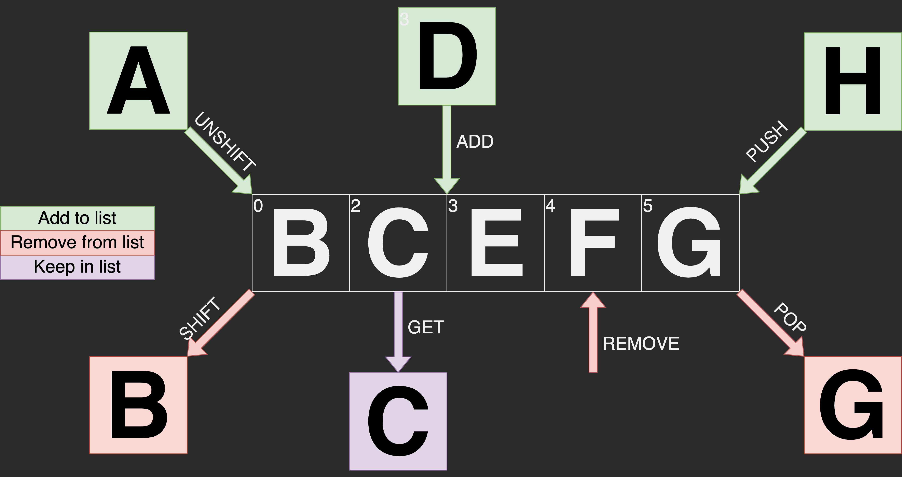

# Secured Linked List
The `SecuredLinkedList` is a library that provides the functionality of a linked list (like in Java or C#). Furthermore, the implementation is thread-safe, see demo `two_core_demo.ino`.
The following figure illustrates the available functions. A detailed description of the functions can be found below.



# Functions
- [Secured Linked List](#secured-linked-list)
- [Functions](#functions)
  - [SecuredLinkedList()](#securedlinkedlist)
  - [void push(T t)](#void-pusht-t)
  - [T pop()](#t-pop)
  - [void add(unsigned int index, T t)](#void-addunsigned-int-index-t-t)
  - [void remove(unsigned int index)](#void-removeunsigned-int-index)
  - [T get(unsigned int index)](#t-getunsigned-int-index)
  - [void unshift(T t)](#void-unshiftt-t)
  - [T shift()](#t-shift)
  - [unsigned int size()](#unsigned-int-size)
  - [void clear()](#void-clear)

## SecuredLinkedList()
The `SecuredLinkedList` can be instantiated as follows.
```
SecuredLinkedList<int> listA = SecuredLinkedList<int>();
SecuredLinkedList<int> *listB = new SecuredLinkedList<int>();
```

## void push(T t)
Adds an element to the end of the list.
```
int t = 4;
listA.push(t);
listB->push(t);
```

## T pop()
Takes the last element from the list.
The list no longer contains the element.
```
Serial.println(listA.pop());
Serial.println(listB->pop());
```

## void add(unsigned int index, T t)
Inserts an element into the according index.
```
int t = 2;
listA.push(3, t);
listB->push(3, t);
```

## void remove(unsigned int index)
Remove an element on index.
```
listA.remove(3);
listB->remove(3);
```

## T get(unsigned int index)
Fetches the element from the according index.
The list still contains the element.
```
Serial.println(listA.get(2));
Serial.println(listB->get()2);
```

## void unshift(T t)
Adds an element to the beginning of the list.
```
int t = 3;
listA.unshift(t);
listB->unshift(t);
```

## T shift()
Takes the first element from the list.
The list no longer contains the element.
```
Serial.println(listA.shift());
Serial.println(listB->shift());
```

## unsigned int size()
Returns the number of elements.
```
Serial.println(listA.size());
Serial.println(listB->size());
```

## void clear()
Deletes all items from the list.
```
listA.clear();
listB->clear();
```
